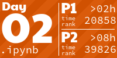
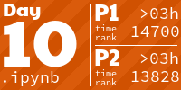
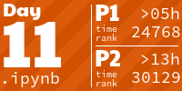

# `aoc2024` README.md

Hello, good evening, and welcome to another Advent of Code repository where you can watch me crash and burn/run out of free time sometime around day 12 ;)

<!-- AOC TILES BEGIN -->
<h1 align="center">
  2024 - 26 ⭐ - Jupyter Notebook
</h1>

<!-- AOC TILES END -->

- Day 01 [[html]](html/day01.html) [[pdf]](pdf/day01.pdf)
- Day 02 [[html]](html/day02.html) [[pdf]](pdf/day02.pdf)
- Day 03 [[html]](html/day03.html) [[pdf]](pdf/day03.pdf)
- Day 04 [[html]](html/day04.html) [[pdf]](pdf/day04.pdf)
- Day 05 [[html]](html/day05.html) [[pdf]](pdf/day05.pdf)
- Day 06 [[html]](html/day06.html) [[pdf]](pdf/day06.pdf)
- Day 07 [[html]](html/day07.html) [[pdf]](pdf/day07.pdf)
- Day 08 [[html]](html/day08.html) [[pdf]](pdf/day08.pdf)
- Day 09 [[html]](html/day09.html) [[pdf]](pdf/day09.pdf)
- Day 10 [[html]](html/day10.html) [[pdf]](pdf/day10.pdf)
- Day 11 [[html]](html/day11.html) [[pdf]](pdf/day11.pdf)
- Day 12 [[html]](html/day12.html) [[pdf]](pdf/day12.pdf)
- Day 13 [[html]](html/day13.html) [[pdf]](pdf/day13.pdf)
- Day 14 [[html]](html/day14.html) [[pdf]](pdf/day14.pdf)
